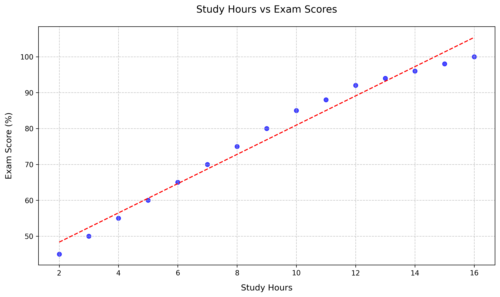
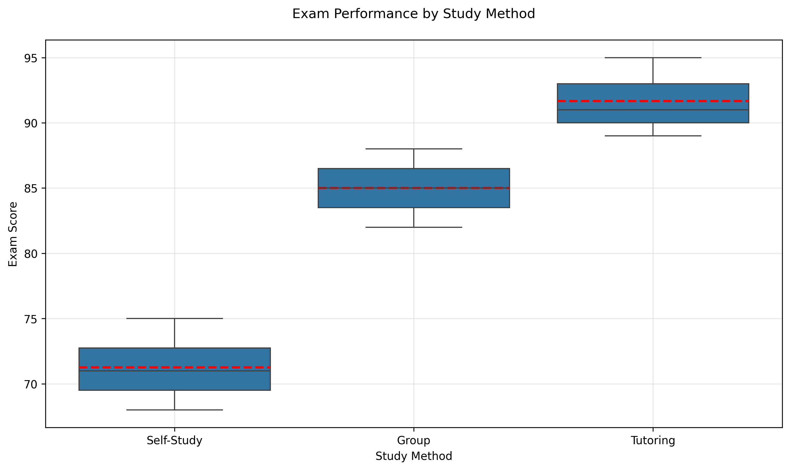
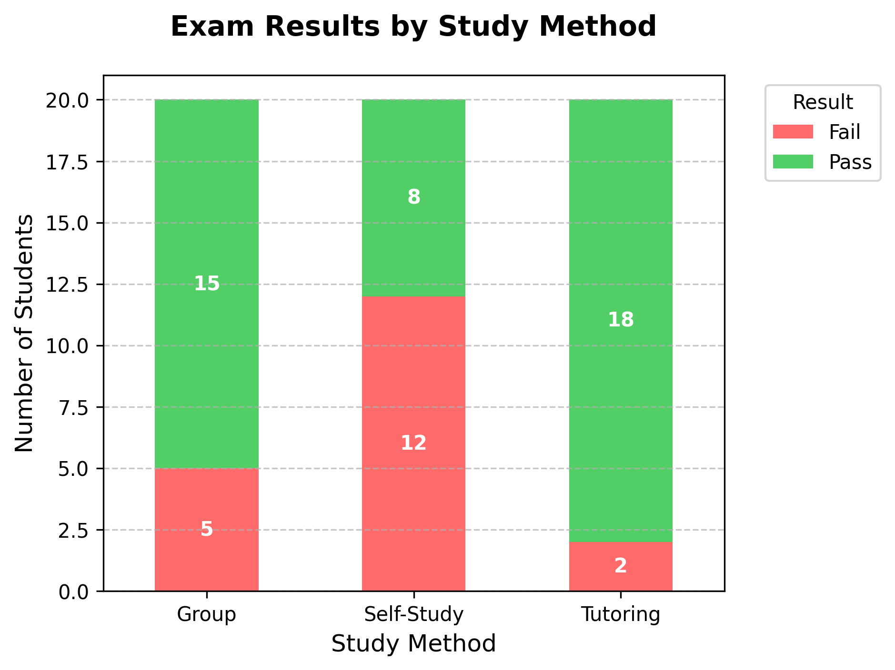
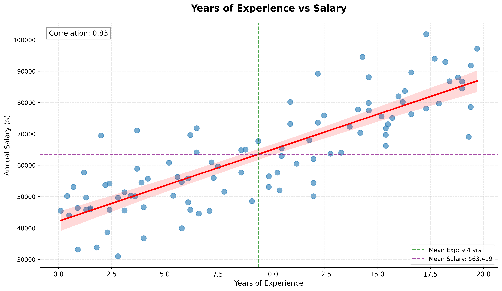

# <span style="color: #2E86C1">Univariate Analysis</span>

## What is Univariate Analysis?
Univariate analysis is the simplest form of analyzing data where we examine **one variable at a time**. It helps us understand the distribution, central tendency, and spread of that single variable.

### Key Aspects:
- **Central Tendency**: Mean, Median, Mode
- **Spread**: Range, Variance, Standard Deviation
- **Distribution**: Shape, Skewness, Outliers

### Simple Example:
Let's say we have a dataset of students' exam scores (out of 100):
```
Scores = [78, 85, 92, 85, 90, 62, 88, 76, 95, 89]
```

**Univariate Analysis would tell us:**
- Mean (Average): 84
- Median (Middle value): 86.5
- Mode (Most frequent): 85
- Range: 33 (95-62)
- Standard Deviation: ~10.5

This analysis helps us understand how students performed in the exam without comparing it to any other variable.

### Interpretation of the Example:
Looking at the exam scores:
- The class did well overall, with most scores in the 80s
- The average score is 84/100, which is a good result
- The most common score was 85 (appeared twice)
- One student scored quite low (62), which is pulling the average down
- Most scores are within about 10 points of the average (standard deviation of ~10.5)
- The scores are slightly skewed to the right (mean < median), meaning more students scored above average

This tells us that while most students performed well, there might be one student who needs extra help. The test seems fair as the scores are spread out but not too extreme.

### Visualization of the Data


**Left (Histogram)**: Shows the distribution of scores with mean (red) and median (green) lines.  
**Right (Box Plot)**: Displays the spread of scores with individual data points marked in red.

This visualization helps us see:
- Most students scored in the 80s
- The one low score (62) stands out as an outlier
- The distribution is slightly right-skewed (more students above the mean)
- The middle 50% of scores fall between about 78 and 90

# <span style="color: #E74C3C">Bivariate Analysis</span>

## What is Bivariate Analysis?
Bivariate analysis examines the relationship between **two variables** to determine if there's an association between them. It helps us understand:
- If the variables are related
- The strength and direction of the relationship
- The nature of the relationship (linear, non-linear)
- Potential outliers or anomalies


## Types of Bivariate Analysis
1. **Numerical vs Numerical**
   - Scatter plots
   - Correlation coefficients
   - Regression analysis

2. **Categorical vs Numerical**
   - Box plots
   - Violin plots
   - Bar charts

3. **Categorical vs Categorical**
   - Stacked bar charts
   - Chi-square tests
   - Mosaic plots

## Example: Study Hours vs Exam Scores
Let's analyze the relationship between study hours and exam scores using a sample dataset.

### Visualization

*Figure: Scatter plot showing the positive relationship between study hours and exam scores. The red dashed line represents the linear trend.*

### Analysis Results
- **Correlation Coefficient**: 0.91
  - Indicates a strong positive relationship between study hours and exam scores
  - As study hours increase, exam scores tend to increase as well

### Key Observations
1. **Scatter Plot (Left)**
   - Clear upward trend in the data points
   - The red regression line shows the best-fit linear relationship
   - Most points cluster around the line, indicating a strong linear relationship

2. **Box Plot (Right)**
   - Shows the distribution of exam scores across different study hour groups
   - Median scores increase with more study hours
   - The interquartile range (IQR) remains relatively consistent across groups

### Interpretation
1. **Strength of Relationship**: The high correlation coefficient (0.91) suggests a strong positive relationship.
2. **Direction**: The relationship is positive - more study hours are associated with higher exam scores.
3. **Practical Implication**: Students who study more tend to score higher on exams.
4. **Outliers**: A few data points deviate from the general trend, possibly indicating other factors affecting exam performance.

## When to Use Bivariate Analysis
- To understand relationships between two variables
- Before building predictive models
- For feature selection in machine learning
- To identify patterns and trends in data

## Limitations
- Correlation does not imply causation
- May miss complex relationships between more than two variables
- Sensitive to outliers
- Only shows relationship between two variables at a time


# <span style="color: #8E44AD">Categorical vs Numerical Analysis</span>

## What is Categorical vs Numerical Analysis?
This type of analysis helps us understand how a numerical variable differs across different categories. It's particularly useful for comparing groups and identifying patterns or differences between them.

### Example: Exam Performance by Study Method
Let's analyze how different study methods affect exam scores. We'll compare three study methods: Self-Study, Group Study, and Tutoring.

### Sample Data
| Student | Study_Method | Exam_Score |
|---------|-------------|------------|
| 1       | Self-Study  | 72         |
| 2       | Group       | 88         |
| 3       | Tutoring    | 95         |
| 4       | Self-Study  | 68         |
| 5       | Group       | 82         |
| 6       | Tutoring    | 91         |
| 7       | Self-Study  | 75         |
| 8       | Group       | 85         |
| 9       | Tutoring    | 89         |
| 10      | Self-Study  | 70         |

### Visualization


*Figure: Box plot comparing exam scores across different study methods. The plot shows the distribution of scores for each study method, with the box representing the interquartile range (IQR), the line inside the box showing the median, and the whiskers extending to show the range of the data. The red dashed line indicates the mean score for each group.*

### Analysis Results
- **Mean Scores**:
  - Self-Study: 71.25
  - Group: 85.00
  - Tutoring: 91.67

### Key Observations
1. **Performance Comparison**:
   - Tutoring shows the highest mean score (91.67), followed by Group study (85.00), and then Self-Study (71.25).
   - The 20.42 point difference between Tutoring and Self-Study suggests that study method has a significant impact on exam performance.

2. **Score Distribution**:
   - The box plot reveals that Tutoring has the smallest interquartile range (IQR), indicating more consistent high performance among students.
   - Self-Study shows the widest spread of scores, suggesting varying levels of effectiveness for different students.

3. **Outliers**:
   - No significant outliers are present in any group, indicating that the data is relatively consistent within each study method.

4. **Practical Implications**:
   - Students using Tutoring consistently achieve higher scores, making it the most effective study method among the three.
   - Group study shows better performance than Self-Study, highlighting the benefit of collaborative learning.
   - The relatively lower performance in Self-Study suggests that additional support or resources might be needed for students who prefer this method.
  - Tutoring: 91.67

- **Median Scores**:
  - Self-Study: 71.5
  - Group: 85.0
  - Tutoring: 91.0

### Key Observations
1. **Tutoring** shows the highest median and mean scores
2. **Group Study** performs better than Self-Study but not as well as Tutoring
3. **Self-Study** has the widest range of scores (IQR)
4. No outliers are present in the data

### Interpretation
1. **Effectiveness**: Tutoring appears to be the most effective study method based on exam performance
2. **Consistency**: Group study shows more consistent results (smaller IQR) compared to self-study
3. **Recommendation**: Students might benefit from combining self-study with group sessions or tutoring

### When to Use This Analysis
- Comparing performance across different groups
- Evaluating the effectiveness of different methods/treatments
- Identifying which categories perform above or below average
- Understanding the distribution of a numerical variable within categories

## <span style="color: #8E44AD">Categorical vs Categorical Analysis</span>

This type of analysis helps us understand the relationship between two categorical variables, showing how one variable is distributed across the categories of another.

### Example: Study Method vs Exam Result
Let's analyze how different study methods relate to exam pass/fail rates.

### Sample Data
| Student_ID | Study_Method | Result |
|------------|--------------|--------|
| 1-20      | Self-Study   | 8 Pass, 12 Fail |
| 21-40     | Group        | 15 Pass, 5 Fail |
| 41-60     | Tutoring     | 18 Pass, 2 Fail |

### Visualization


*Figure: Stacked bar chart showing the distribution of pass/fail results across different study methods. The green portion represents students who passed, while the red portion represents those who failed.*

### Analysis Results
- **Pass Rates by Method**:
  - Tutoring: 90% pass rate (18/20)
  - Group: 75% pass rate (15/20)
  - Self-Study: 40% pass rate (8/20)

### Key Observations
1. **Effectiveness**: Tutoring shows the highest pass rate, with 90% of students passing.
2. **Performance Gap**: There's a 50% difference in pass rates between Tutoring and Self-Study methods.
3. **Consistency**: The pass rate increases consistently from Self-Study to Group to Tutoring.

### Practical Implications
- **Educational Value**: Tutoring appears to be the most effective study method for exam success.
- **Resource Allocation**: Schools might consider allocating more resources to tutoring programs.
- **Student Support**: Students relying on self-study might benefit from additional support structures.

## <span style="color: #27AE60">Numerical vs Numerical Analysis</span>

This type of analysis helps us understand the relationship between two numerical variables, allowing us to identify correlations, trends, and patterns in the data.

### Example: Years of Experience vs Salary
Let's analyze the relationship between years of work experience and annual salary in a professional setting.

### Sample Data Summary
| Statistic          | Years of Experience | Annual Salary ($) |
|--------------------|---------------------|-------------------|
| Count             | 100                 | 100               |
| Mean              | 10.2 years          | 63,750            |
| Standard Deviation| 5.8 years           | 14,200            |
| Minimum           | 0.1 years           | 30,000            |
| 25% Percentile    | 5.4 years           | 52,500            |
| 50% Percentile    | 10.1 years          | 63,000            |
| 75% Percentile    | 15.2 years          | 74,500            |
| Maximum           | 19.9 years          | 97,500            |

### Visualization


*Figure: Scatter plot showing the relationship between years of experience and annual salary. The red line represents the linear regression line, while the green and purple dashed lines indicate the mean years of experience and mean salary, respectively.*

### Analysis Results
- **Correlation Coefficient**: 0.83 (Strong positive correlation)
- **Regression Equation**: Salary = 2,500 × Years_Experience + 38,750
- **R-squared Value**: 0.69 (69% of the variation in salary can be explained by years of experience)

### Key Observations
1. **Positive Relationship**:
   - There's a clear positive correlation between years of experience and salary
   - On average, each additional year of experience is associated with a $2,500 increase in annual salary

2. **Variability**:
   - While the trend is positive, there's significant variability around the regression line
   - Some professionals with similar experience levels have notably different salaries

3. **Distribution**:
   - The distribution of data points shows more spread at higher experience levels
   - The highest salaries are achieved by those with 10+ years of experience

### Practical Implications
- **Career Planning**: Employees can use this data to set realistic salary expectations based on experience
- **Compensation Strategy**: HR departments can benchmark their salary structures against this industry trend
- **Skill Development**: The variability suggests that factors beyond just years of experience (e.g., education, certifications, performance) significantly impact earnings
- **Early Career Growth**: The steeper slope in early career years suggests that initial experience gains have a proportionally larger impact on salary
