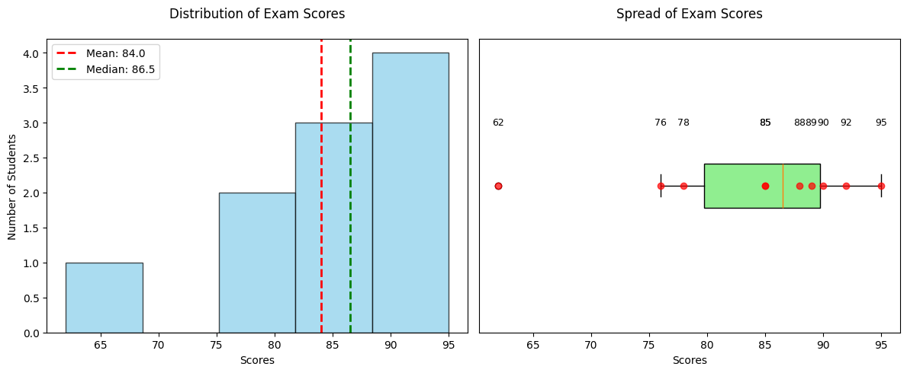

# <span style="color: #2E86C1">Univariate Analysis</span>

## What is Univariate Analysis?
Univariate analysis is the simplest form of analyzing data where we examine **one variable at a time**. It helps us understand the distribution, central tendency, and spread of that single variable.

### Key Aspects:
- **Central Tendency**: Mean, Median, Mode
- **Spread**: Range, Variance, Standard Deviation
- **Distribution**: Shape, Skewness, Outliers

### Simple Example:
Let's say we have a dataset of students' exam scores (out of 100):
```
Scores = [78, 85, 92, 85, 90, 62, 88, 76, 95, 89]
```

**Univariate Analysis would tell us:**
- Mean (Average): 84
- Median (Middle value): 86.5
- Mode (Most frequent): 85
- Range: 33 (95-62)
- Standard Deviation: ~10.5

This analysis helps us understand how students performed in the exam without comparing it to any other variable.

### Interpretation of the Example:
Looking at the exam scores:
- The class did well overall, with most scores in the 80s
- The average score is 84/100, which is a good result
- The most common score was 85 (appeared twice)
- One student scored quite low (62), which is pulling the average down
- Most scores are within about 10 points of the average (standard deviation of ~10.5)
- The scores are slightly skewed to the right (mean < median), meaning more students scored above average

This tells us that while most students performed well, there might be one student who needs extra help. The test seems fair as the scores are spread out but not too extreme.

### Visualization of the Data



**Left (Histogram)**: Shows the distribution of scores with mean (red) and median (green) lines.  
**Right (Box Plot)**: Displays the spread of scores with individual data points marked in red.

This visualization helps us see:
- Most students scored in the 80s
- The one low score (62) stands out as an outlier
- The distribution is slightly right-skewed (more students above the mean)
- The middle 50% of scores fall between about 78 and 90

# <span style="color: #E74C3C">Bivariate Analysis</span>

## What is Bivariate Analysis?
Bivariate analysis examines the relationship between **two variables** to determine if there's an association between them. It helps us understand:
- If the variables are related
- The strength and direction of the relationship
- The nature of the relationship (linear, non-linear)
- Potential outliers or anomalies

## Types of Bivariate Analysis
1. **Numerical vs Numerical**
   - Scatter plots
   - Correlation coefficients
   - Regression analysis

2. **Categorical vs Numerical**
   - Box plots
   - Violin plots
   - Bar charts

3. **Categorical vs Categorical**
   - Stacked bar charts
   - Chi-square tests
   - Mosaic plots

## Example: Study Hours vs Exam Scores
Let's analyze the relationship between study hours and exam scores using a sample dataset.

### Visualization


### Analysis Results
- **Correlation Coefficient**: 0.91
  - Indicates a strong positive relationship between study hours and exam scores
  - As study hours increase, exam scores tend to increase as well

### Key Observations
1. **Scatter Plot (Left)**
   - Clear upward trend in the data points
   - The red regression line shows the best-fit linear relationship
   - Most points cluster around the line, indicating a strong linear relationship

2. **Box Plot (Right)**
   - Shows the distribution of exam scores across different study hour groups
   - Median scores increase with more study hours
   - The interquartile range (IQR) remains relatively consistent across groups

### Interpretation
1. **Strength of Relationship**: The high correlation coefficient (0.91) suggests a strong positive relationship.
2. **Direction**: The relationship is positive - more study hours are associated with higher exam scores.
3. **Practical Implication**: Students who study more tend to score higher on exams.
4. **Outliers**: A few data points deviate from the general trend, possibly indicating other factors affecting exam performance.

## When to Use Bivariate Analysis
- To understand relationships between two variables
- Before building predictive models
- For feature selection in machine learning
- To identify patterns and trends in data

## Limitations
- Correlation does not imply causation
- May miss complex relationships between more than two variables
- Sensitive to outliers
- Only shows relationship between two variables at a time

## Python Implementation
```python
# Basic bivariate analysis with pandas and seaborn
import seaborn as sns
import matplotlib.pyplot as plt

# Sample data
import numpy as np
np.random.seed(42)
study_hours = np.random.normal(5, 1.5, 100)
exam_scores = 30 + 5 * study_hours + np.random.normal(0, 3, 100)

# Create DataFrame
import pandas as pd
data = pd.DataFrame({
    'Study_Hours': study_hours,
    'Exam_Score': exam_scores
})

# Scatter plot with regression line
plt.figure(figsize=(10, 6))
sns.regplot(x='Study_Hours', y='Exam_Score', data=data, scatter_kws={'alpha':0.6})
plt.title('Study Hours vs Exam Score')
plt.xlabel('Study Hours')
plt.ylabel('Exam Score')
plt.grid(True, alpha=0.3)
plt.tight_layout()
plt.show()

# Calculate correlation
correlation = data['Study_Hours'].corr(data['Exam_Score'])
print(f"Correlation coefficient: {correlation:.2f}")
```

## Further Reading
- Pearson's correlation coefficient
- Spearman's rank correlation
- Hypothesis testing for correlation
- Linear regression analysis
